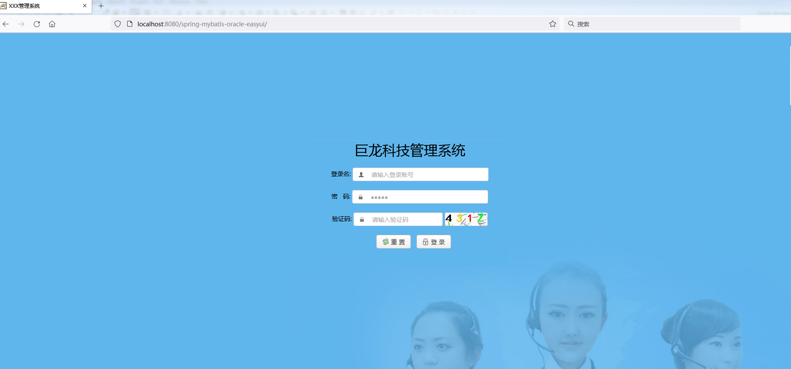

# spring-mybatis-mysql-easyui
spring+mybatis+mysql+easyui+redis实现的后台管理

spring版本：3.2.8.RELEASE

mybatis版本：3.2.0

mysql版本：5.6

easyui版本：1.7.5

redis版本：2.8.0

### 1. 登录模块

密码实现rsa加密传输、验证码一分钟失效、三次输入错误锁定账户操作

### 2.首页

3.用户模块

新增用户

修改用户

基本的系统管理功能均已实现
